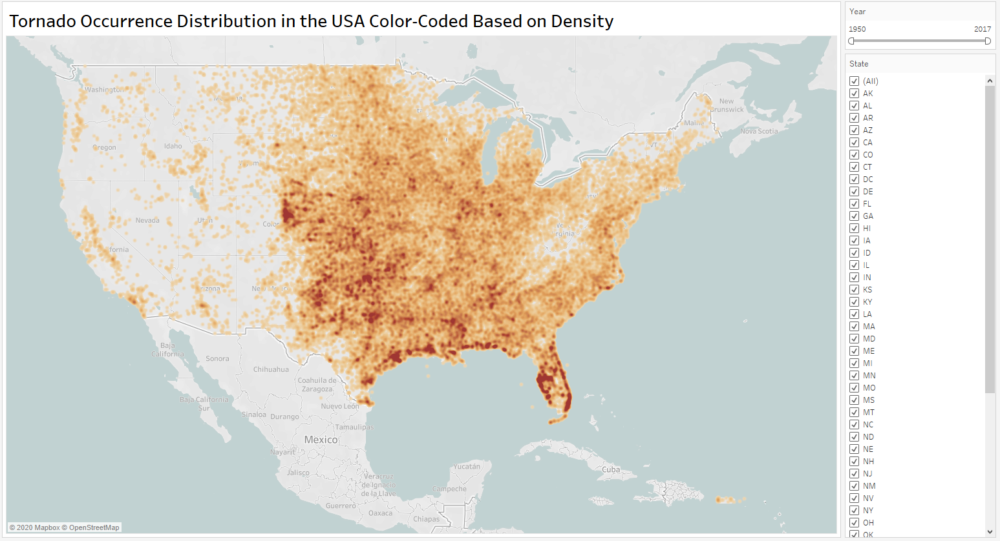
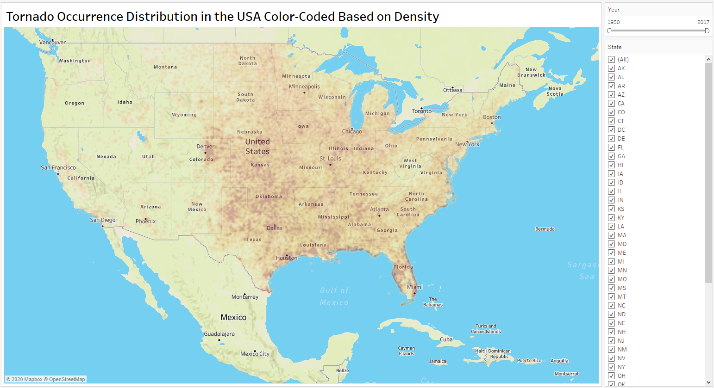
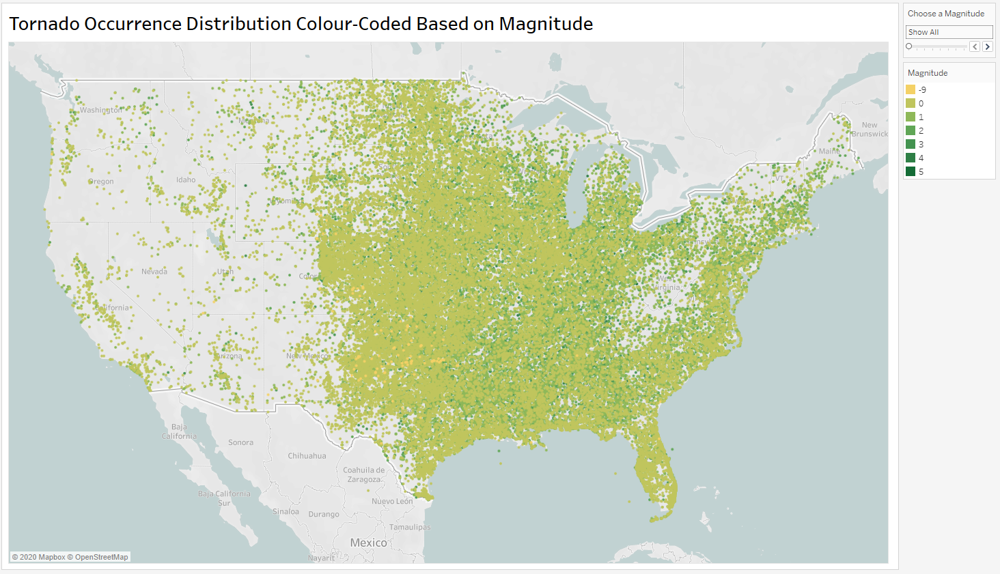

# tornado-visualizations
Visualizations of tornado data in the United States from 1950 to 2018. The visualizations were made using Tableau. The purpose of this project was to investigate how frequent and dangerous the tornadoes in the United States have been and their distribution throughout the country. The following sections have been taken from the project [report](Visualization-Project-Report---Nardiena-Althafia-Pratama.pdf).

1. [Data](#data)
2. [Project Aims](#project-aims)
3. [Project Purpose](#project-purpose)
3. [Data Source](#data-source)
4. [Visualizations: How Tornadoes Are Distributed Through the United States](#Number-of-Casualties-and-Tornado-Frequency-Over-Time-–-Complex-Behaviour-Over-Time-and-Multiple-Dependent-Variables)
5. 

## Data
For this project, I have created visualisations of tornado occurrences in the United States of America from 1950 to 2018 inclusive. The data includes a variety of fields – the ones that are relevant to this project are listed below:
- Tornado number (om)
- Date and time of tornado occurrence (year, month, day, date, time)
- State of tornado occurrence
- F-scale or magnitude
- Injuries
- Fatalities
- Starting latitude and longitude of the tornado

The data was obtained from National Oceanic and Atmospheric Administration’s (NOAA) National Weather Service Storm Prediction Center. The website’s link is https://www.spc.noaa.gov/wcm/#data.

## Project Aims 
The aim of this project is to visualise the tornado occurrences in the U.S. using the dataset obtained above. The focus will be on:
- Mapping out the locations of each storm occurrence on the U.S. map
- Visualising the trends and patterns between casualty numbers and tornado frequencies over the years
- Visualising the trends and patterns between casualty numbers and tornado frequencies with respect to each state
- Highlighting trends on casualty numbers based on the magnitude

## Project Purpose
The purpose of this project is to analyse the distribution patterns of the storms, and how frequent and dangerous the tornadoes have been.

The distribution patterns of the tornadoes can be helpful as it identifies where the hotspots of the storms are, as well as finding out how often a certain area could expect the storms to happen, if any.

It is also useful to know how frequent and dangerous these storms can be. This is because it helps create more awareness in terms of how people prepare for the storms. The data visualisations can help expose how unsafe each tornado magnitude is based on the casualty trends and patterns.

## Data Source
The dataset used in this project can be found on the Severe Weather Database Files section of the Warning Coordination Meteorologist’s (WCM) Page on the National Oceanic and Atmospheric Administration’s (NOAA) National Weather Service Storm Prediction Center website.

The Storm Prediction Center (SPC) is defined to be “a government agency that is part of the National Centers for Environmental Prediction (NCEP), operating under the control of the National Weather Service (NWS), which in turn is part of the National Oceanic and Atmospheric Administration (NOAA) of the United States Department of Commerce (DoC).” 

The database files are separated by the category of the severe weather (tornado, hail, and damaging wind) and by year of occurrences, from 1950 to 2018, each on a separate CSV file. It is also possible to retrieve the CSV files for all occurrences of each severe weather event from 1950 to 2018 (combined), instead of downloading a CSV for each year. The database downloaded and used for this project is the file that has all the occurrences of tornadoes from 1950 to 2018 (the latter).

# Visualizations

## How Tornadoes Are Distributed Through the United States – Complex Behaviour Over Space

A density distribution map of tornado occurrences in the United States is shown in figure 1. Using the map, it is possible to see areas in the country that have had higher densities of tornadoes (number of tornadoes per unit area) from 1950 up to 2018, or any time period in between.

The year filter is set so that the time period for the occurrences start in 1950 up to 2018. A pattern that is revealed is that the south-eastern area has the highest densities of tornadoes. The south-eastern area bordering the gulf (the Gulf Coast) and several areas towards the centre regions also show high densities, whereas the lowest tornado densities are mostly in the western area of mainland US.

>*Figure 1: A density distribution map showing the location of each tornado occurrence from 1950 to 2015 – darker areas signify higher densities of tornadoes.*

In figure 2 below, the same map is shown, but with a more transparent layer for the densities and a more prominent colour for the map background – so that the state areas are more identifiable. Although this map doesn’t reveal the density patterns nearly as good as the previous one (due to it being more transparent), this one shows the state names to better identify where exactly the hotspots are.

>*Figure 2: A density distribution map showing the location of each tornado occurrence from 1950 to 2015 (the same as above), with slightly different configurations.*

As seen in figure 2, the hotspots are located mostly in the Florida state, followed by the southern area, which includes part of Texas and Louisiana, and some areas in the central states, such as Kansas, Oklahoma, and Colorado.

As shown from both figure 1 and 2, there seems to be very few to no occurrences of tornadoes in the western region of the United States, which include Oregon, Idaho, Washington, Nevada, California, among others.

Another aspect that can be explored when it comes to the tornadoes’ distributions is how they are spread out in terms of magnitude, where 0 is the lowest, 5 is the highest, and -9 represents unknown magnitudes. This is shown in figure 3.

From the figure below, it is fairly obvious that the vast majority of the tornadoes have been of a magnitude of 0 to 1, with magnitudes 2 and 3 following behind. Most of the tornadoes with unknown magnitudes (yellow) are located towards the central-southern area, more specifically the Texas state area. However, based on this map alone, it is rather difficult to determine the distributions for some of the other magnitudes, such as magnitudes 4 and 5.

>*Figure 3: A colour-coded distribution map based on magnitude for tornado occurrences from 1950 to 2018.*

In order to reveal the distribution patterns for magnitudes 4 and 5, the ‘Choose a Magnitude’ filter is set to magnitudes 4 and 5 in figures 4 and 5, respectively.
From figure 4 (below), there seems to be fewer Magnitude 4 tornadoes compared to the ones of Magnitude 0, and that they seem to be fairly spread out towards the eastern-central areas of the country.

.png)
>*Figure 4: A colour-coded distribution map based on magnitude for tornado occurrences from 1950 to 2018 (magnitude 4 is highlighted in brown).*

Figure 5 (below) shows the distribution for Magnitude 5 tornadoes. There seems to be no particular trend or pattern other than the storms are spread out, again, towards the eastern-central areas.

.png)
>*Figure 5: A colour-coded distribution map based on magnitude for tornado occurrences from 1950 to 2018 (magnitude 5 is highlighted in brown).*

Based on figures 4 and 5, it can be seen that the presumably “more dangerous” tornadoes occur less frequently compared to the lower magnitude tornadoes, as shown in figure 4.

## Number of Casualties and Tornado Frequency Over Time – Complex Behaviour Over Time and Multiple Dependent Variables

In this section, patterns between casualties and tornado frequencies will be explored.

In figure 6 below, on the top line graph which shows the numbers of fatalities and injuries versus time, there doesn’t seem to be a distinguishable relationship that can be deduced between the two variables and time. Although the numbers fluctuate from year to year, it shows several peaks in 1953, 1965, 1971, 1974, 1979, 1984, and 2011 – most of the peaks are until 1984; after that it only peaked again in 2011. The number of injuries (0-8000 range) seem to be consistently higher than the number of fatalities (0-600 range). This may be because it is more likely that a person was to get injured due to a tornado storm than to die, assuming that most people in tornado hotspots would likely have access to bunkers and other safety places.

The middle line graph shows the number of casualties (fatalities + injuries) versus time. Since the number of casualties is just a summation of the number of fatalities and injuries, it isn’t surprising that there seems to be a similar trend to the previous graph in that there are several peaks until 1984, and another peak later in 2011.
The bottom line graph shows the number of tornado occurrences recorded every year from 1950 to 2018. Unlike the other two graphs, this one shows a noticeable relationship between the number of records and time. It seems that as the years increase, so does the number of tornado occurrences.

However, despite the increasing number of tornadoes over the years, the lack of positive correlation on the number of casualties seems odd. It should be expected that more tornadoes would result in more casualties, but it may not be the case here due to external factors – perhaps tornado occurrences back then weren’t being recorded as accurately in certain places as they are now, hence the lower number of records back in the 1950s up to the late 1990s compared to the 2000s.

>*Figure 6: Three stacked line graphs that show the correlations between number of fatalities, injuries, total casualties, and tornado occurrences versus time (in years).*
